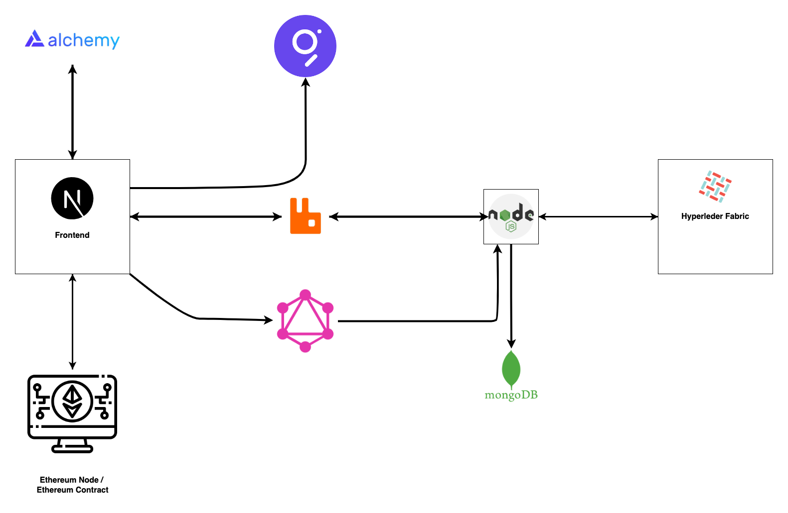

# Voting With NFT

### Use-Case

It is proof of concept for Voting based on `NFT`, One User One `NFT`.
Now it will create few question in mind which are given below.

- How it Work?
- How you insure One User One NFT?
- How Voting Will Work?

#### Start Answering Questions one by one

---

- <b>How it Work?</b>
  We will write an `smart contract` on which user can `Mint` there `Digital Idenetity NFT` only once and that `NFT` is not `Transfer` to other user, once it will belong to user `A` It will never `Transfer` to user `B`, It will become `Digital Idenetity` of user `A`.

- <b>How you insure One User One NFT ?</b>
  To Mint NFT will used user finger Print Hash, so when user `Mint NFT` it will used one secret password and it finger print to create it Digital Identity (NFT).
  -- New Questions come in mind everyone have five finge in one hand (normally)?
  we will design system that it will accept only one finger right hand index finger is allow to register (Mint NFT). `if some don't have one it will be in record , which record it will explain given below`.
  -- How you will verify user Finger Print and Identity which it is try to used are some?
  We are plaining to create Private Blockchain Own by government which will provide user finger print data and addtional detail like diability (missing finger).

- <b>How Voting Will Work?</b>
  When user want to vote he will used his Fingre Print and Token Id to Vote, and his vote will be Sign By his Private Key and store into Distributed Storage (Private Blockchain). Once Voting will complete it will process but Smart Contract.

#### Problems

- How to Get Finger Print and it Verfication ?
- How to used Signature based DOA ?
- How to make Oricel will create for contract?
- How to Add DOA with ERC712?
- How to Implement Proxy on update contract?
- How to Implement Proxy for Voting Contract to Start New elections.,

#### Steps

1. Create Contract
   Governor Contract with ERC712 Support
   ERC712 Contract with (no Transfer and Verfication Feature)
   Voting Contract
   Proxy Contract
2. Create Test Case For Contract's
3. Set Hypereledger Fabric
   Contract
   Network
   API
4. Connector for Ethereum and Hyperledger
5. Interface with NextJS
   Design
   SubGraph Connection
   Alchmey Connection
6. Setup Subgrph

## Architecture

# Thank you!

