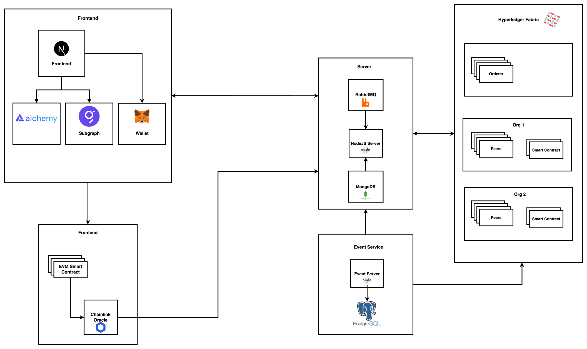

# DVS
## Inspiration

## Inspiration
After dedicating four years to working in Blockchain technology, collaborating with numerous companies and participating in various Blockchain-related projects, I have realized. The majority of popular Blockchain projects tend to revolve around DeFi, NFTs, or cryptocurrencies. However, I've observed that other industries such as supply chain, healthcare, and document verification are also attempting to leverage Blockchain technology. Unfortunately, most of these efforts remain in the prototyping stage, often utilizing private Blockchains that are not widely accepted by the Blockchain community as true Blockchains. Through extensive research, discussions with industry professionals, and drawing from my personal experiences, I have identified several reasons for this phenomenon:

- Cost of Transactions: Public Blockchains involve transaction fees, commonly known as gas costs, which can be prohibitively expensive for certain use cases.

- Trust on Data: When private Blockchains are employed, end users may encounter trust issues regarding the validity and integrity of the data, as they lack transparency and decentralization.

- Privacy of Data: Companies are reluctant to expose all of their sensitive data to the public nature of a Blockchain, leading to concerns about privacy and security.

- User Management: Managing user identities within both public and private Blockchains presents a challenge, requiring efficient and secure identity management solutions.

These factors collectively contribute to the limited adoption of Blockchain technology in non-crypto-focused industries, as the existing barriers hinder widespread implementation and acceptance.    

## Project Overview
The project idea is seemingly straightforward: assigning one NFT on the Ethereum blockchain to each user and utilizing it as their digital identity on a public blockchain. This would enable users to sign documents and prove their identity on a distributed network. However, the implementation is not as simple as it may appear. One major challenge arises when trying to verify user identity on a publicly distributed network, as public blockchains typically use wallet addresses as identities.

To address this challenge, we aim to provide comprehensive answers to the questions that may arise. These answers will shed light on the core issue we aim to solve, how we plan to solve it, the benefits of a one-user-one-identity system, the differentiation of our solution from existing alternatives (if any), and the cost efficiency of our approach.

- What is the actual issue we are trying to solve?
The primary problem within the blockchain market is that it remains predominantly focused on specific sectors such as art NFT platforms, game NFTs, DeFi, and digital tokens. However, the potential of blockchain technology extends to various sectors like real estate, healthcare, and supply chain. The reason these sectors are not actively leveraging blockchain technology is twofold: the high costs associated with public blockchains and the inability to expose all client data to public chains due to privacy concerns.

-  How are we going to solve this issue?
Our solution involves leveraging the strengths of two well-established platforms: Hyperledger Fabric and the Ethereum public blockchain. By combining these platforms, we aim to maximize the benefits of both public and private blockchains, effectively addressing the challenges mentioned earlier.

### Hyperledger Fabric 
Hyperledger Fabric is a blockchain framework commonly used by governments, organizations, and the general public to store private information that should not be exposed to the public. It serves as a platform for sharing such sensitive data among different organizations securely.
### Ethereum 
Ethereum is a blockchain platform that typically stores public information. However, in our proposed system, we introduce a slight modification. Instead of storing actual data on the public chain, which would significantly increase costs without providing substantial benefits compared to existing systems, we generate a digital signature of the user data. Only the hash of the data is stored on the public chain, similar to a Layer 2 solution on Ethereum. Rather than having a single company or organization store all the data, each respective organization retains ownership of its data. By storing the hash of the data on the public chain, any tampering with the private chain can be identified and detected. This ensures the integrity and security of the data while utilizing the benefits of the public blockchain for identity verification and validation purposes.

- What is the benefit of one user one Identity? 
The adoption of a one-user-one-identity system offers several benefits. Firstly, it significantly improves user identity management, even within public blockchains, which is currently a challenging task. This system empowers users to establish and validate their identities consistently across different platforms and services worldwide.

To verify user identities on the public blockchain, we employ the use of an Oracle. Oracles enable public blockchains to access and incorporate real-world data. In our solution, we leverage an Oracle to facilitate the verification of user identities. The architecture and internal workings of this solution will be further elaborated upon, providing a more comprehensive understanding of its functionality.

- How your solution is different from the existing solution if exists? 
Our solution stands out from existing solutions because it addresses several gaps in the current blockchain landscape. Most blockchain solutions available today are either based on public or private blockchains and lack involvement from government entities or regulatory frameworks. This hinders their adoption in real-world scenarios. In contrast, our solution aims to bridge these gaps, making blockchain solutions more readily adoptable. By incorporating government entities and regulatory compliance measures, we enhance the feasibility and acceptance of blockchain technology in practical applications.

- Does it is cost efficient?
Our solution takes into consideration the cost efficiency aspect. Public blockchains are known to incur high transaction fees, making them costly for users. However, one advantage is the absence of hardware costs. On the other hand, private blockchains require infrastructure management but offer zero transaction fees for users. By combining both chains in our solution, we aim to reduce the cost of public chain transactions. This is achieved by storing only the hash of data in the public chain, resulting in lower fees for users. Additionally, the fees collected help support the maintenance and sustainability of the private infrastructure. Thus, our solution offers a balanced approach that minimizes costs while ensuring the functionality and security of the blockchain system.
`Supportive link from my own test cases ` [Medium](https://medium.com/coinmonks/ethereum-sign-transactions-60b1cc5dea4a

## System Working:

Let's talk a little bit about how it works, it follows transactions and data in our purpose systems.

Following is a list of actions or transactions that will happen in our system.
We have a Private Blockchain Smart Contract Solution which will be used to verify User identity and help the Public Blockchain create that user's Digital Identity.
Then we have Private Blockchain Smart Contracts and Public Blockchain Smart Contracts to manage sharing Document details and store Transaction signatures.
We have Admin or Organization Portal to Manage Authenticity and Data on User Fingerprint details or other Details.
Then We have two different modes for the user.
The first was to manage the Digital Identity
The Second was related to managing their Digital Sign NFT Document.

Now it is time to discuss each action separately to understand what happens under the hood.

### Admin or Organization Portal:
Here we are to Government and organizations store their information like username, User Id Card (National Id Card Number or Passport), and Fingerprint, on a Private Blochian Smart contract which helps the system to verify it. We will provide them separate interface or integrate their existing system with Private Blockchain to share new information with the system this is a one-way process once data is added it will not allow any authority to temper or update it.

### User Digital Identity Creation:
The Idea is every government or organization somehow manages user Fingerprints in their system, we want to move them to Private Blockchain Hyperledger Fabric and provide a gateway to verify user identity. 

### Following are the steps for verifications. 
1. We have a Smart Contract Running on Ethereum EVM (Ethereum Virtual Machine). The user who wants to verify their identity will provide their user id (National Id Card Number or Passport), Fingerprint, and copy of the card.
2.Then Ethereum Smart Contract calls Private Hyperledger Fabric API, passes that information, and waits for its verification.
3. Once Ethereum Smart Contract is notified the user verification result will allow the user to create an NFT of his Digital Identity.
4. We will use image processing techniques Like so many other companies in the open market is used to verify whether the card is original or not (additional) 

### Document Sharing and Signature Process:
Once User Identity is verified and Digital NFT Identity is created, It’s time to use it to sign Document.
### Following are the steps for Sign Document.
1. The user will upload a document that he/she wants to sign by another User in the system.
2. Once the document is uploaded, we will verify the user’s identity with his NFT in the existing Public Chain and allow them to Create a Digital signature of all of the Data Upload Documents to IPFS and store the Digital signature in a Private Blockchain Smart Contract.
3. Other Users will notify the new Document arrives for a signature because all those users are already verified with their Digital identity (NFT) on Public Chain.
4. Once all the signatures are done it is up to the Owner of the document there are two scenarios 
-- The First one is a private Document between internal parties that will not share publicly but is important to sign by all parties then it will be stored in a private Blockchain.
-- In the second case Document owner insane one transaction on the Public Blockchain and Create an NFT of the Document which will be on the public chain and visible to everyone. (Benefit of doing this let’s suppose we have 5 different people who are going to sign the Document everyone will sign separately and pay a 5-time transaction fee which will more expensive if will process the transaction at once when you think everything is ready).

## Architecture
The following diagram will show the architecture of the system. It shows the technologies, platforms, and interaction of different component components.

  

The system is divided into four parts and each part is explained briefly below.

1.  Hyperledger Fabric.
    
2.  Hyperledger Server and Services
    
3.  Ethereum Smart Contract
    
4.  Frontend
    

### Hyperledger Fabric:

This part is composed of different organizations and governments which will share data and store Document signatures to support the system.

1.  It will provide User detail to verify User identity on Public Blockchain
    
2.  It stores document signatures until it will be processed and reached their final state.
    
3.  Each organization and governments have its Peer to store only its information and hash of other organization data.
    

  

### Hyperledger Server and Services:

It helps the user to interact with the Hyperledger Fabric Smart contract and do the transaction on the system.

#### It is divided into two parts:

1.  Nodejs Server responds to all the requests to do transactions or get data from Private Blockchain.
    
2.  Event Service which will record all the events on Hyperledger Fabric Smart contract and record some data on off-chain to make transactions faster.
    

  
  

### Ethereum Smart Contract:

It’s a very important part of the system which helps us to increase the trust in the system and share data on the Public Blockchain so it will be easily accessible to everyone who is going to verify it.

#### It is having three Smart Contract:

1.  User Digital Identify verifier and NFT Creation, is going to handle all the transactions related to the user identity.
    
2.  Oracle Smart Contract is going to support User Digital Identify smart contracts to get data from outside of the world (Private Blockchain).
    
3.  Document Smart contracts for all the transactions related to the Document NFT (Signature Verification, Document NFT creation, and view it)
    

  
  

### Frontend:

It is a place where all those parts are connected and allows users to interact with one another without hassle. The UI is different based on the user type and allows them to perform their actions.

## Challenges 
The Issue I think we will face in the future when we will go to deploy we maybe face a few challenges.
1. One User one NFT of Digital Identity because it depends on User Fingerprint.
2. Trust on the platform ( we have to create storage trust of companies on our project so then will adopt it)  

## Accomplishments 
I have achieved significant milestones in my project, including the successful creation of a demo and testing key functionalities. These accomplishments encompass various aspects such as user identity creation, seamless data sharing between private and public blockchains, and optimizing operational costs.

## What's next for DVS

My plan is to expand the scope of this project beyond document sharing and apply it to a wide range of industries such as supply chain, healthcare, eKYC, gaming, and more. The goal is to develop this project into a versatile platform that can be utilized by different companies, eliminating architectural dependencies and concerns about the underlying technology. By offering a seamless solution, every organization can benefit from the capabilities provided by this platform without having to worry about the intricacies of its inner workings.
### Use-Case

It is proof of concept for Voting based on `NFT`, One User One `NFT`.
Now it will create few question in mind which are given below.

- How it Work?
- How you insure One User One NFT?
- How Voting Will Work?

#### Start Answering Questions one by one

---

- <b>How it Work?</b>
  We will write an `smart contract` on which user can `Mint` there `Digital Idenetity NFT` only once and that `NFT` is not `Transfer` to other user, once it will belong to user `A` It will never `Transfer` to user `B`, It will become `Digital Idenetity` of user `A`.

- <b>How you insure One User One NFT ?</b>
  To Mint NFT will used user finger Print Hash, so when user `Mint NFT` it will used one secret password and it finger print to create it Digital Identity (NFT).
  -- New Questions come in mind everyone have five finge in one hand (normally)?
  we will design system that it will accept only one finger right hand index finger is allow to register (Mint NFT). `if some don't have one it will be in record , which record it will explain given below`.
  -- How you will verify user Finger Print and Identity which it is try to used are some?
  We are plaining to create Private Blockchain Own by government which will provide user finger print data and addtional detail like diability (missing finger).

- <b>How Voting Will Work?</b>
  When user want to vote he will used his Fingre Print and Token Id to Vote, and his vote will be Sign By his Private Key and store into Distributed Storage (Private Blockchain). Once Voting will complete it will process but Smart Contract.

#### Problems

- How to Get Finger Print and it Verfication ?
- How to used Signature based DOA ?
- How to make Oricel will create for contract?
- How to Add DOA with ERC712?
- How to Implement Proxy on update contract?
- How to Implement Proxy for Voting Contract to Start New elections.,

`Most Important How I create Oricel  On ethereum.`

# Thank you!

